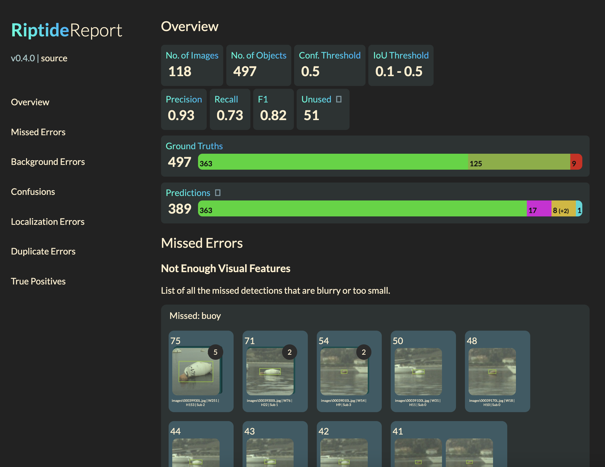

# Riptide

Evaluation tooling for object detection models.



## Installation

1. Riptide requires Python 3.10. We recommend using conda.

    ```
    conda create -n riptide python=3.10
    conda activate riptide
    pip install poetry
    poetry install
    ```

2. You may encounter an installation issue with hdbscan (0.8.29). If so, you can install it manually via pip:
    ```
    pip install hdbscan
    ```

3. Finally set the Bifrost environment variables in `.env`:
    ```
    BIFROST_INSTANCE_URL = "xxx.app.bifrost.ai"
    RIPTIDE_UPLOAD_KEY = "abcdwxyz"
    ```

## Getting Started
For any quantitative evaluation, you need:
- Ground truths (targets)
- Predictions

Ground truths should be in COCO format.

Predictions should be in COCO format with an additional `score` field for each detection annotation:
```
{
    "id": 123,
    "image_id": 123,
    "category_id": 1,
    "bbox": [x, y, width, height],
    "score": 0.95
}
```

The `images` and `categories` data in the predictions JSON should match those in the ground truth JSON.

## Report Generation
Run `create_report.py` to generate a report from your predictions and ground truths:
```
poetry run python create_report.py -t gt.json -p pred.json -i path/to/images
```

The report can then be found on the Bifrost platform, where it can be viewed.

## Sections in the Evaluation Report
The report is divided into the following sections:

### Overview
This section provides a summary of the performance of the model, in terms of the number of ground truths, predictions, and the error distribution for each model.

### Error Visualization
These sections provide visualizations of the errors for each error type. The errors are grouped by error type, class, and perceptual similarity, in order. Perceptual similarity is determined by computing cluster labels for the feature embeddings of ground truths and background errors, using the [HDBSCAN algorithm](https://github.com/scikit-learn-contrib/hdbscan). The cluster labels are then used to group the errors into perceptually similar groups.

Predictions are grouped into the following categories:
- **Missed Errors (MIS)**: Ground truths that were not detected by the model.
- **Background Errors (BKG)**: Predictions that do not correspond to any ground truth.
- **Confusions (CLS + CLL)**: Predictions that correspond to a ground truth, but are classified as a different class.
- **Localization Errors (LOC)**: Predictions that correspond to a ground truth, but have poor localization.
- **Duplicate Errors (DUP)**: Predictions that correspond to a ground truth, but are duplicate detections.

For more information on the error types, see [Understanding Error Types](error_types.md).